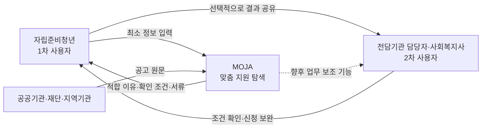
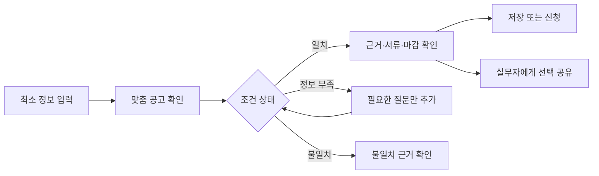
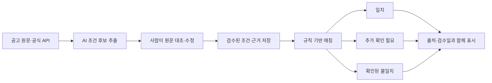
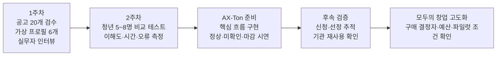

# 모자 — 모아보자, 자립청년

자립지원 제도는 부처·지자체·기관에 흩어져 있고, 대부분 **나이와 보호종료 후 지난 기간**에
따라 신청 기간이 끝납니다. 모자는 흩어진 제도를 모아, 지금 나에게 맞는 것만 골라 보여줍니다.

Campus AX-Ton 팀 **파란만**의 4주 MVP 프로젝트입니다.

## 시작하기

```bash
npm install
npm run dev
```

브라우저에서 http://localhost:3000 을 엽니다.

## 화면 구성

| 경로 | 화면 |
|---|---|
| `/` | 소개 |
| `/filter` | 내 상황 입력 (상태·보호종료 연월·지역·관심 주제) |
| `/result` | 경과 타이머 + 제도 4구역 (신청 대상 / 아직은 아님 / 확인 필요 / 기간 지남) |
| `/program/[id]` | 제도 상세 (요약·조건 대조표·필요 서류·근거 원문·신청 사이트 링크) |

## 설계 원칙

- **개인정보 최소화**: 이름·연락처·생년월일을 받지 않습니다. 입력값은 연월 단위로만 받고
  `localStorage`에만 저장하며 서버로 전송하지 않습니다. URL에도 담지 않습니다.
- **AI는 문서 전처리에만 사용**: 판정 로직(`app/lib/eligibility.ts`)은 결정론적 룰 매칭이며
  런타임에 AI를 호출하지 않습니다. 제도 요약은 미리 만들어 `app/lib/programs.ts`에 저장합니다.
- **미확인은 미확인으로 표시**: 자격 조건 원문을 직접 확인한 제도만 `verified: true`로
  표시하고, 확인 못 한 제도는 자동으로 "확인 필요"로 분류됩니다.

## 폴더 구성

```
app/
├── lib/
│   ├── programs.ts       ← 제도 시드 데이터
│   ├── eligibility.ts    ← 판정 엔진
│   └── profileStore.ts   ← localStorage 저장/조회
├── filter/               ← 내 상황 입력
├── result/               ← 판정 결과 목록
├── program/[id]/         ← 제도 상세
├── diagnose/, report/    ← 1회차 개인 과제(전세레이더) — 별도 산출물, 유지
└── page.tsx / layout.tsx
```

## 참고

기획 배경, 시장 검증 과정, 데이터 출처는 팀 공유 계획 문서를 참고하세요.

---

## 기획·리서치 통합 문서

아래 내용은 모두의 창업 2기와 Campus AX-Ton 해커톤을 함께 준비하기 위해 정리한 통합 피드백 및 리서치 실행안입니다.

- [통합 피드백 및 고도화 방향](#integrated-feedback)
- [리서치 보완 근거 및 실행안](#research-evidence)

### 한눈에 보는 MOJA

| 구분 | 현재 결정 |
|---|---|
| 1차 사용자 | 자립준비청년 |
| 2차 사용자 | 자립지원전담기관 담당자·사회복지사 |
| 핵심 문제 | 흩어진 공고보다, 복합 조건을 이해하고 신청 준비로 이어가는 과정 |
| 초기 해법 | 공공·민간 공고 통합 탐색 + 조건별 근거 + 추가 확인 질문 + 서류·마감 안내 |
| 핵심 차별점 | 설명 가능하고 사람이 검수한 조건 판정 |
| 해커톤 범위 | 검수한 소수 공고로 청년의 탐색부터 실무자 공유까지 완주 |
| 후순위 | 공개 커뮤니티, 1대1 멘토링, 정책 분석 대시보드 |

<a id="integrated-feedback"></a>

# MOJA 통합 피드백 및 고도화 방향

- 작성일: 2026-09-16
- 리서치 보완일: 2026-09-17
- 검토 자료: `MOJA_모창_전체답변_수정본.pdf`
- 적용 범위: 모두의 창업 2기 지원 및 Campus AX-Ton 해커톤 준비
- 문서 목적: 현재 지원서와 서비스의 부족한 점을 정리하고, 초기 타깃·핵심 문제·MVP 기능·검증 계획을 팀 회의에서 결정하기 위한 공통 기준을 남긴다.

2026-09-17 보완: 청년 우선 방향은 유지한다. 강원 실무자 부담의 공식 근거, 기존 서비스의 실제 기능, 민간 공고의 조건 사례를 반영했다. 아래 기능은 개발 제안이며 구현 완료를 뜻하지 않는다. 세부 출처·통계 해석·검증 과제는 [리서치 보완 근거 및 실행안](#research-evidence)에 정리했다.

## 1. 핵심 결론

현재 MOJA의 가장 큰 부족점은 기능이 적다는 것이 아니라 **자립준비청년을 1차 사용자로 둔 상태에서 첫 문제와 첫 사용 장면이 하나로 좁혀지지 않았다는 점**이다.

현재 답변에는 다음 네 가지 사업이 동시에 포함되어 있다.

1. 청년용 맞춤 지원 탐색
2. 기관 실무자용 업무 도구
3. 커뮤니티 및 선후배 멘토링
4. 기관·재단용 데이터 분석

비전으로는 모두 의미가 있지만, 초기 제품에 함께 넣으면 다음 문제가 발생한다.

- 누구를 위한 제품인지 불명확해진다.
- 해커톤에서 구현해야 할 핵심 기능이 흐려진다.
- 수익모델을 검증하기 전에 여러 운영 부담이 생긴다.
- 심사자가 “무엇부터 검증할 것인가”를 파악하기 어렵다.

따라서 초기 MOJA는 **자립준비청년이 자신에게 맞는 지원을 직접 찾고 이해하도록 돕는 서비스**로 좁힌다. 전담기관이 주로 안내하는 공공 지원도 함께 제공하되, MOJA가 우선 발굴할 영역은 청년과 담당자가 놓치기 쉬운 민간·재단·지역 공고로 설정한다. 기관 실무자와 사회복지사는 2차 사용자이자 향후 기관용 기능의 대상으로 둔다.

## 2. 권장 초기 포지셔닝

> MOJA는 자립준비청년이 공공 지원뿐 아니라 놓치기 쉬운 민간·재단·지역 공고까지 자신의 조건에 맞게 찾고, 적합한 이유와 확인할 조건, 준비 서류를 쉽게 이해하도록 돕는 맞춤형 지원 탐색 서비스입니다.

### 서비스 구조

- 1차 사용자: 자신의 조건에 맞는 지원을 직접 찾고 신청하려는 자립준비청년
- 2차 사용자: 자립지원전담기관 담당자, 시설 종사자, 사회복지사 등 청년을 지원하는 실무자
- 정보 범위: 공공 지원을 기본 정보로 함께 제공하되, 민간·재단·지역 공고를 우선적으로 발굴하고 고도화
- 잠재 구매자: 전담기관, 비영리단체, 후원재단, 지원사업 운영기관
- 청년의 최초 사용 흐름: `최소 정보 입력 → 맞춤 공고 확인 → 적합 이유·추가 확인 조건 이해 → 준비 서류·마감 확인 → 저장·공유·신청`
- 향후 실무자 사용 흐름: `청년 초대·등록 → 맞춤 결과 검토 → 필요한 공고 추천 → 신청 진행 상태 확인`

#### 사용자와 서비스의 관계



#### 청년의 핵심 이용 흐름



초기 검증 대상은 강원 지역 협력기관을 통해 자발적으로 참여할 성인 자립준비청년 중, 학업·취업·생활비 지원 공고를 직접 비교하려는 사람으로 제안한다. 대학생만 모집하지 않고 취업준비·재직 등 다른 상황도 포함한다. 이는 파일럿 모집 범위이며 서비스의 전체 이용 자격을 제한하는 기준은 아니다. 기관 연결 없이 쓰는 청년의 경로도 별도로 확인한다.

민간 공고 우선은 수집·검수 투자의 우선순위다. 결과 정렬은 공공·민간 구분보다 청년의 필요, 확인된 조건, 모집 상태, 마감일을 우선한다. 보호종료 후 5년 경과만으로 서비스 이용이나 모든 공고를 차단하지 않고 사업별 기준을 확인한다.

현장 인터뷰에 따르면 주요 공적 지원은 담당 기관과 상담사가 신청까지 적극적으로 안내한다. 따라서 MOJA가 공공 지원 체계를 대체한다고 설명해서는 안 된다. 청년에게 공공 지원도 함께 보여주어 정보의 완결성을 확보하되, **청년과 담당자가 모두 파악하기 어려운 민간·지역·재단 공고를 우선 발굴하고 맞춤화한다**고 설명하는 편이 설득력이 높다.

기관용 기능은 청년용 서비스와 분리된 두 번째 제품이 아니라, 청년이 더 많은 지원을 발견하고 신청하도록 돕는 보조 인터페이스로 설계한다. 기관이 실제로 이 기능에 비용을 지불할지는 별도로 검증해야 할 가설이다.

## 3. 현재 답변에서 부족한 부분

### 3.1 1차 사용자와 확장 사용자의 우선순위가 불명확했다

1차 사용자는 자립준비청년으로 확정한다. 기관 실무자와 사회복지사는 청년의 지원 탐색과 신청을 돕는 2차 사용자로 구분한다.

- 자립준비청년: 1차 사용자이자 핵심 문제의 당사자
- 기관 실무자·사회복지사: 청년의 결과를 검토하고 추가 공고를 추천하는 2차 사용자
- 기관 책임자 또는 재단 담당자: 구매 결정 가능성이 있는 사람

여기서 사용자와 구매자를 혼동하지 않는다. 청년이 가장 먼저 쓰는 서비스라도, 향후 비용은 기관이나 재단이 지불하는 구조가 가능하다.

### 3.2 문제의 크기를 보여주는 증거가 부족하다

상담사 인터뷰는 방향을 수정하는 데 의미가 있지만, 한 명의 의견만으로 청년의 실제 이용 의사나 기관용 기능의 수요를 증명할 수는 없다. 추가로 확인해야 할 내용은 다음과 같다.

- 청년이 지원 정보를 현재 어디서 찾고 어떤 단계에서 포기하는지
- 공공 지원 외에 민간·재단·지역 공고를 놓친 경험이 있는지
- 맞춤 결과에서 무엇을 알아야 실제 신청으로 이어지는지
- 실무자가 민간 공고 탐색과 정리에 사용하는 시간
- 실무자 1인당 담당 청년 수와 반복적으로 수행하는 정보 안내 업무
- 현재 공고를 발견하고 청년에게 전달하는 방법
- 조건 해석이 어렵거나 놓치는 공고의 유형
- 청년이 안내를 받은 뒤 신청까지 가지 못하는 지점
- 기관 내부의 구매 결정자와 예산 집행 방식
- 기관이 유료 파일럿에 참여할 의사가 있는지

**확인된 배경 근거:** 국회예산정책처의 2025년 보고서는 2024년 배치 정원 기준 인력 1명당 청년 수를 강원 61.8명, 전국 43.3명으로 제시한다(인쇄면 136~137쪽). 이는 지역 격차의 근거이지, 2026년 현직 담당자의 실제 관리 인원이나 공고 검색 시간은 아니다. [공식 보고서](https://nabo.go.kr/board/file/down.do?fid=33318728)

2026년 자립지원 업무매뉴얼의 정원은 강원 10명, 전국 240명이며 탈 고립·은둔 전담인력을 포함한다(1권 인쇄면 22쪽). 2024년 대상자 수와 2026년 정원을 섞어 현재 1인당 담당 인원을 계산하지 않는다. [2026년 공식 매뉴얼](https://www.ncrc.or.kr/ncrc/na/ntt/selectNttInfo.do?mi=1177&nttSn=10577)

기존 19명 설문도 모집 경로, 실제 당사자 여부, 응답 원본을 확인한 뒤 탐색적 조사로 활용한다. 전체 자립준비청년의 수요를 대표한다고 쓰지 않는다.

### 3.3 기존 서비스와의 차별점이 약하다

`공공·민간 통합`, `개인 맞춤`, `커뮤니티`만으로는 강한 차별화가 어렵다. MOJA의 차별점은 다음과 같이 구체화해야 한다.

- 왜 해당 공고가 적합한지 설명한다.
- 왜 비대상으로 보이는지 설명한다.
- 어떤 조건을 추가로 확인해야 하는지 알려준다.
- 판정에 사용한 공고 원문, 출처, 기준일을 표시한다.
- 공고의 변경·마감·폐지를 추적한다.
- AI가 추출한 조건과 사람이 검수한 이력을 구분한다.

즉, 단순한 추천 서비스가 아니라 **설명 가능하고 검증 가능한 조건 판정 시스템**으로 정의해야 한다.

자립정보ON 공개 화면에는 이미 공공·민간 제공기관 필터, 분야·지역·모집상태 검색과 맞춤정보 안내가 있다. 보건복지부도 2024년에 민간기관 회원 및 모집·선발 기능 신설을 발표했다. 현재 로그인 후 업무 범위는 미검증이므로 “기관 로그인 자체가 없다”는 문구를 차별점으로 쓰지 않는다. MOJA는 청년의 미확인 조건을 정리하고 실무자가 그 결과를 검토하는 과업에서 추가 가치를 입증해야 한다. [지원사업 검색](https://jaripon.ncrc.or.kr/home/kor/support/projectMng/index.do?menuPos=1) · [보건복지부 발표](https://www.mohw.go.kr/board.es?act=view&bid=0027&list_no=1480211&mid=a10503010100)

### 3.4 고정된 12개 질문의 한계가 있다

지원사업마다 요구 조건이 다르기 때문에 모든 청년에게 동일한 질문을 받는 방식은 불필요한 개인정보를 수집하면서도 필요한 조건을 놓칠 수 있다.

권장 방식은 다음과 같다.

1. 최소한의 기본 프로필만 입력한다.
2. 공고별로 아직 확인되지 않은 조건을 찾는다.
3. 필요한 질문만 추가로 요청한다.
4. 결과를 `입력 조건 일치 / 추가 확인 필요 / 확인된 조건 불일치`로 표시한다. 이 분류는 선정 확률이 아니다.
5. 각 결과에 이유와 공식 출처를 함께 제시한다.
6. 최종 자격 판단은 해당 기관에 있음을 명시한다.

미입력 값은 불일치로 처리하지 않는다. 공고의 `접수 중 / 예정 / 마감` 상태는 자격 조건과 별개로 표시한다. 필수 자격과 선발 우대조건, 필수 서류와 선택 서류도 나눈다. 실제 민간 공고에는 잔여 학기·복학 예정·중복지원·필수 활동 참여 조건이 있으므로 하나의 연령 필터로 판정하지 않는다. 구체적인 공고 사례와 테스트 항목은 보완 근거 문서 4절을 따른다.

### 3.5 수익모델이 너무 앞서 있다

분석 대시보드는 충분한 이용량과 신뢰할 수 있는 데이터가 쌓인 이후에야 가치가 생긴다. 개인정보, 낙인, 대표성 문제도 크다.

초기에는 기관의 반복 업무 하나에 대한 사용료만 검증하는 것이 좋다.

- 공고 수집 및 구조화
- 담당 청년 일괄 매칭
- 청년에게 보낼 안내문 생성
- 마감 일정 및 준비 서류 관리
- 신청 진행 상태 확인

데이터 분석 서비스는 초기 수익모델이 아니라 장기 확장 가설로 분리한다.

정부·지자체·기관이 비용을 지불할 이유는 단순히 데이터를 제공받기 때문이라고 설명하지 않는다. 다음과 같은 가치 연결을 실제 사용 결과로 검증한 뒤 제시한다.

`청년의 지원 발견·신청 증가 → 실무자의 공고 탐색·안내 업무 감소 → 반복적으로 막히는 조건과 미충족 수요 파악 → 지원사업 운영 개선`

정책 개선용 분석은 사업 운영의 참고자료라는 확장 가설이다. 집계값도 소수 지역·희귀 조건 조합으로 개인을 알아볼 수 있으므로 목적·접근권한·소수 집계 노출을 검토한다. 충분한 이용량과 구매 수요가 확인되기 전에는 초기 매출 근거로 사용하지 않는다. 정부나 재단의 기존 사업 예산을 MOJA 구매 예산으로 간주하지 않는다.

### 3.6 커뮤니티는 초기 MVP에서 제외하는 편이 좋다

공개 커뮤니티와 1대1 멘토링은 다음 운영 체계가 필요하다.

- 이용자 인증과 익명성 기준
- 신고·차단·제재 절차
- 위기 상황 개입 기준
- 전문기관 연결
- 멘토 검증과 활동 범위 설정
- 개인정보 및 상담 내용 보호

초기에는 다음과 같은 제한된 방식이 적합하다.

- 검수된 자주 묻는 질문
- 지원사업별 경험 정보
- 기관이 중재하는 비공개 질문
- 검증된 선배가 참여하는 소규모 온라인 설명회

자유게시판과 1대1 멘토링은 운영 역량과 안전 체계를 확보한 뒤 검토한다.

## 4. 기능 구현 우선순위

### P0: 자립준비청년용 핵심 기능

- 최소 정보 기반의 맞춤 공고 탐색
- 공공 지원과 민간·재단·지역 공고의 통합 결과 제공
- 민간·재단·지역 공고의 우선 발굴 및 필요·자격·마감 중심 정렬
- 공고 원문과 공식 출처 저장
- 지원 대상, 기간, 지역, 소득, 서류 등 조건 구조화
- 공고별 최종 확인일과 검수 상태 기록
- `입력 조건 일치 / 추가 확인 필요 / 확인된 조건 불일치` 분류와 별도 모집 상태
- 각 결과의 이유와 추가 확인 사항 표시
- 준비 서류, 마감일, 신청 경로 안내
- 관심 공고 저장 및 실무자와 공유
- 마감·변경·폐지 감지
- 잘못된 정보 신고와 수정 이력 관리

AI는 공고에서 조건 후보를 추출하는 데 활용하되, 최종 서비스의 판정은 검수된 규칙과 데이터에 따라 수행하는 것이 안전하다.

#### AI 활용과 사람의 검수 구조



AI가 최종 자격이나 선정 가능성을 결정하지 않는다. 원문에서 조건 후보를 정리하고 변경을 감지하는 보조 역할만 맡는다.

해커톤 최소 범위는 위 기능 중 검수한 소수 공고, 조건별 근거 표시, 추가 질문, 서류·신청 경로, 선택적 결과 공유에 집중한다. 모집 종료 처리는 필수로 구현하고, 전체 사이트 자동 변경 감시와 대량 대상자 관리는 이후 단계로 둔다. 외부 연결이 실패하면 마지막 검수 데이터와 확인 시각을 표시한다.

### P1: 실무자·사회복지사용 보조 기능

- 동의받은 청년의 최소 프로필 관리
- 여러 청년에 대한 공고 일괄 매칭
- 청년에게 전달할 안내 카드 또는 안내문 생성
- 준비 서류 체크리스트
- 관심·문의·신청·완료 상태 기록
- 실무자와 청년이 함께 확인할 수 있는 결과 공유

### 후순위 기능

- 공개 커뮤니티
- 선후배 1대1 매칭
- 기관용 종합 분석 대시보드
- 이용자 데이터 판매 또는 광범위한 수요 분석
- 자유형 AI 상담 챗봇

## 5. 개발 전 검증 계획

새로운 기능을 많이 개발하기 전에 약 2주간의 수작업 파일럿을 진행하는 것이 좋다. 파일럿은 청년의 직접 이용 가능성을 먼저 확인하고, 실무자에게는 결과의 정확성과 보조 기능의 필요성을 확인한다.

### 파일럿 절차

1. 최근 민간·재단 공고 약 20개를 사람이 직접 구조화한다.
2. 동의받은 실제 사례 또는 가상 프로필로 매칭 결과를 만든다.
3. 청년이 직접 최소 정보를 입력하고 결과를 탐색하게 한다.
4. 청년이 적합 이유, 확인 조건, 준비 서류를 이해하는지 확인한다.
5. 실무자가 기존 방식과 MOJA 결과를 비교하고 필요한 공고를 추가 추천하게 한다.
6. 저장·공유·문의·신청까지 이어지는 과정을 확인한다.

비교 대상은 자립정보ON 또는 평소 검색 방식이다. 같은 과업을 수행하되 순서를 바꾸어 학습 효과를 줄인다. 가상 프로필은 조건 판정 검증에, 자발적 실제 참여자는 사용성·수요 검증에 사용하며 두 결과를 구분한다. 청년 참여가 어려워 실무자 테스트만 했다면 당사자 검증 완료로 발표하지 않는다.

2주 안에는 탐색 시간, 조건 이해, 다음 행동 설명, 도움 요청을 측정한다. 신청·선정·수혜는 공고 일정에 맞춰 후속 확인하며 링크 클릭을 신청 완료로 기록하지 않는다. 상세 지표와 제안 목표는 보완 근거 문서 7절에 있다.

### 확인할 지표

- 청년이 혼자 맞춤 공고를 찾고 이해할 수 있는지
- 민간·재단·지역 공고를 새롭게 발견한 비율
- 청년의 결과 이해도
- 안내 후 문의·저장·신청·완료 전환
- 잘못된 적합 판정과 누락 사례
- 실무자 판단과 MOJA 판정의 일치 정도
- 공고 정리와 대상자 선별에 걸리는 시간
- 실무자의 반복 사용 의사
- 기관의 파일럿 및 유료 사용 의사

### 전환 또는 중단 기준

- 청년이 맞춤 결과를 직접 탐색하지 않는다면 진입 방식과 핵심 문제를 재검토한다.
- 청년이 결과를 이해하지만 신청하지 않는다면 핵심 문제를 정보 탐색이 아니라 신청 실행으로 다시 정의한다.
- 조건 판정 오류를 충분히 통제하기 어렵다면 추천 범위를 줄이고 정보 정리·확인 보조 기능부터 제공한다.
- 실무자가 보조 기능을 필요로 하지 않는다면 기관용 화면은 후순위로 내린다.
- 기관이 비용을 지불하지 않으려 한다면 재단·공고 운영기관 등 다른 구매자를 검증한다.

## 6. 지원서 문항별 수정 방향

### Q1. 한 문장 소개

- 정보 탐색과 관계 연결을 동시에 말하지 않는다.
- 초기 제품이 해결하는 한 가지 과업을 표현한다.
- 자립준비청년이 직접 지원을 찾고 이해하는 행동을 개선한다는 점을 드러낸다.

### Q2. 문제 발견과 창업 동기

- 긴 문제의식보다 인터뷰, 설문, 서비스 이용 결과를 제시한다.
- 공적 지원은 기관이 적극적으로 안내한다는 반대 증거도 포함한다.
- 그래서 민간 공고 탐색과 조건 확인으로 문제를 좁혔다는 과정을 보여준다.
- 담당자 1인당 관리 인원과 업무 부담은 좋은 근거가 될 수 있지만, 공식 통계나 추가 인터뷰로 확인한 수치만 사용한다.

### Q3-1. 차별점

- 공공·민간 정보 통합 자체를 핵심 차별점으로 두지 않는다.
- 민간·재단·지역 공고의 우선 발굴, 근거가 표시되는 조건 판정, 실무자와의 결과 공유를 강조한다.
- 추천 결과가 최종 수급 자격 확정이 아님을 분명히 한다.

### Q3-2. 수익모델

- 청년에게는 핵심 탐색 기능을 무료로 제공하고, 기관용 보조 기능의 계약 가능성을 검증한다.
- 데이터 분석은 장기 확장 가설로 분리한다.
- 1차 사용자와 실제 비용 지불자가 다를 수 있음을 명시하고 구매 결정 구조를 검증한다.
- 구매 이유를 `청년 지원 → 담당자 업무 보조 → 운영 개선`의 단계로 설명하되, 각 단계의 효과를 파일럿 지표로 증명한다.

### Q4. 사업화 계획

- 네 가지 제품을 순서대로 모두 개발한다는 계획을 피한다.
- 청년용 맞춤 탐색을 중심으로 하나의 파일럿, 성공 기준, 실패 시 전환 기준을 제시한다.
- 커뮤니티 확대보다 청년의 직접 이용, 정보 신뢰성, 실제 신청 전환을 먼저 확인한다.
- 해커톤에서는 작동하는 청년용 핵심 흐름과 AI의 기술적 역할을, 창업 지원에서는 고객 검증과 지속 가능한 운영·수익 구조를 강조한다.

### Q4-2. 멘토링 요청

- 전반적인 조언을 요청하기보다 실제 의사결정에 필요한 질문을 제시한다.
- 예: 초기 구매자는 전담기관과 민간재단 중 누구로 설정해야 하는가?
- 예: 기관이 유료 파일럿을 결정하려면 어떤 성과지표가 필요한가?
- 예: 청년 대상 조사를 안전하고 부담이 적게 진행하려면 어떤 절차가 필요한가?

## 7. 팀 회의에서 결정해야 할 사항

다음 항목을 회의에서 하나씩 결정한다.

1. 청년이 처음 접속했을 때 가장 먼저 해결해야 할 한 가지 문제는 무엇인가?
2. 공공 지원을 어느 깊이까지 제공하고 민간·재단·지역 공고를 어떤 기준으로 우선 노출할 것인가?
3. 청년이 입력해야 하는 최소 정보는 무엇인가?
4. 해커톤에서 반드시 작동해야 하는 청년 중심의 한 가지 흐름은 무엇인가?
5. 실무자용 화면은 청년용 MVP와 동시에 만들지, 다음 단계로 미룰 것인가?
6. 커뮤니티를 MVP에서 제외할 것인가?
7. 청년용 파일럿과 기관용 파일럿의 성공 기준은 각각 무엇인가?
8. 어떤 결과가 나오면 현재 가설을 포기하거나 변경할 것인가?

## 8. 기존 링크 및 자료 정리 원칙

기존 링크와 자료를 한꺼번에 삭제하지 않는다. 먼저 다음 기준으로 구분한다.

### 유지

- 정부·공공기관의 최신 정책 원문
- 공고의 실제 출처
- 자립정보ON 등 비교 서비스 링크
- 인터뷰·설문 결과의 원본
- 현재 기능이나 정책 판단의 근거가 된 자료
- 이후 변경 여부를 확인해야 하는 자료

### 보관함으로 이동

- 내용은 유효하지만 현재 MVP와 직접 관련이 없는 자료
- 커뮤니티·멘토링·분석 서비스 등 후순위 기능 참고자료
- 이전 버전의 지원서와 발표자료
- 중복되어 있지만 수정 이력을 남길 필요가 있는 자료

### 삭제 후보

- 완전히 동일한 중복 링크
- 접속할 수 없고 대체 원문이 확보된 링크
- 출처가 불명확한 요약·재가공 자료
- 현재 정책과 충돌하는 오래된 정보
- 테스트 과정에서 생성된 임시 링크

삭제 전에는 가능하면 `왜 삭제하는지`, `어떤 최신 자료로 대체했는지`를 간단히 남긴다. Notion이나 Drive에서는 즉시 삭제하기보다 `참고자료 보관함`으로 옮기는 방식이 안전하다.

## 9. 현재 단계의 한 문장 판단

MOJA에 지금 필요한 것은 기능을 더 많이 추가하는 것이 아니라, **자립준비청년이 민간 공고를 포함한 맞춤 지원을 직접 찾고 실제 신청까지 이어갈 수 있는지 먼저 검증하고, 실무자용 기능이 이를 얼마나 보완하는지 확인하는 것**이다.

## 10. 관련 자료

- 지원서 원문: `/Users/nope_jun/Downloads/MOJA_모창_전체답변_수정본.pdf`
- 기존 리서치 브리프: `outputs/MOJA_해커톤_리서치_브리프_2026-09-14.md`

## 11. 2026-09-16 추가 피드백 반영 판단

### 바로 반영할 내용

1. **담당자의 업무 부담을 문제 구조에 포함한다.**
   - 공공 지원을 기관이 잘 안내한다는 사실과 실무자의 부담은 서로 모순되지 않는다.
   - MOJA가 필요한 이유를 기관의 실패가 아니라, 한정된 시간 안에 공공·민간·지역 공고를 모두 확인하고 청년별로 설명하기 어려운 구조에서 찾는다.
2. **청년용 화면과 실무자용 화면의 역할을 구분한다.**
   - 청년용 화면은 직접 탐색과 신청 준비가 중심이다.
   - 실무자용 화면은 청년의 결과 검토, 추가 추천, 신청 과정 보조가 중심이다.
3. **정부·지자체·기관의 구매 이유를 결과 흐름으로 설명한다.**
   - 청년에게 더 많은 지원 기회가 연결된다.
   - 실무자의 반복적인 탐색·분류·안내 업무가 줄어든다.
   - 집계된 미충족 수요는 사업 운영 개선을 위한 참고자료가 될 수 있다.

### 추가 검증 후 반영할 내용

- 담당자 1인당 관리 인원
- 공고 탐색과 안내에 실제 사용하는 시간
- 자립정보ON의 기관회원·모집 기능과 사례관리 보조 기능의 실제 차이(기관회원 계획은 공식 확인, 현재 로그인 후 범위는 미검증)
- 기관이 별도 실무자 로그인을 필요로 하는지
- 정부·지자체가 분석 또는 업무 도구에 지불할 의사가 있는지
- 어떤 부서와 담당자가 도입과 구매를 결정하는지

이 항목들은 인터뷰 의견이나 팀의 추정으로 단정하지 않고, 공식 자료·서비스 직접 확인·복수 실무자 인터뷰를 통해 검증한 뒤 사용한다.

### 그대로 반영하면 위험한 내용

- “담당자가 너무 많은 청년을 관리한다”와 같이 수치 없이 일반화하는 표현
- “정부가 데이터를 구매할 것”이라는 검증되지 않은 수익 주장
- 조회·저장 데이터를 실제 신청 또는 수혜 성과로 간주하는 것
- 기존 기관과 플랫폼이 지원을 제대로 하지 못한다는 경쟁적 표현

MOJA는 기존 공공 지원 체계를 대체하기보다 **청년의 직접 탐색권을 넓히고 실무자의 지원 업무를 보완하는 서비스**로 설명한다.

## 12. 모두의 창업 2기와 AX-Ton 해커톤의 공통·개별 준비

두 프로그램에서 사용하는 핵심 문제와 제품은 동일하게 유지한다. 다만 평가 목적에 맞춰 강조점을 다르게 구성한다.

아래는 팀의 준비 전략 제안이다. 두 프로그램의 공식 평가표와 제출·시연 조건은 이번 조사에서 확인하지 않았으므로, 공고가 확보되면 그 기준에 맞춰 조정한다.

### 공통 핵심

- 1차 사용자는 자립준비청년이다.
- 공공 지원도 제공하되 민간·재단·지역 공고를 우선 발굴한다.
- 단순 공고 추천이 아니라 적합 이유, 추가 확인 조건, 준비 서류를 설명한다.
- 실무자용 기능은 청년의 탐색과 신청을 돕는 보조 인터페이스다.
- 공개 커뮤니티와 데이터 분석은 MVP 이후 단계로 둔다.

### Campus AX-Ton 해커톤에서 강조할 내용

- 실제로 작동하는 청년 중심 사용자 흐름
- AI를 활용한 비정형 공고의 조건 추출과 구조화
- 검수된 규칙을 이용한 설명 가능한 매칭
- 불확실한 조건을 `추가 확인 필요`로 분리하는 안전장치
- 공고 원문, 출처, 최종 확인일을 보여주는 신뢰성
- 청년이 결과를 실무자에게 공유하고 도움을 요청하는 흐름

#### 권장 시연 시나리오

1. 청년이 최소 정보를 입력한다.
2. 공공 지원과 민간 공고가 함께 표시된다.
3. 민간 공고 하나를 선택한다.
4. 적합 이유, 추가 확인 조건, 준비 서류, 마감일을 확인한다.
5. 결과를 저장하거나 실무자에게 공유한다.
6. 실무자가 결과를 검토하고 신청 준비를 보완한다.

해커톤에서는 많은 화면보다 이 한 가지 흐름이 오류 없이 끝까지 작동하는 것이 중요하다.

### 모두의 창업 2기에서 강조할 내용

- 인터뷰를 통해 문제 정의가 수정된 과정
- 청년, 실무자, 구매 결정자의 구분
- 기존 서비스와 겹치지 않는 구체적인 차별점
- 청년의 이용과 신청 전환을 검증하는 방법
- 기관용 기능의 업무 절감 효과와 도입 가능성
- 개인정보 보호와 사람의 검수 절차
- 유료 파일럿까지 이어지는 단계별 사업화 계획

### 하나의 제품, 두 개의 설명

- 해커톤 질문: **AI를 이용해 이 문제를 얼마나 정확하고 안전하게 해결했는가?**
- 창업 지원 질문: **누가 반복해서 사용하고, 누가 어떤 이유로 비용을 지불하는가?**

발표자료와 지원서의 표현은 달라져도 사용자 정의, 핵심 문제, 데이터 기준, MVP 범위는 서로 일치해야 한다.

---

<a id="research-evidence"></a>

# MOJA 리서치 보완 근거 및 실행안

- 조사일: 2026-09-17
- 적용: 모두의 창업 2기, Campus AX-Ton 해커톤 공통
- 기준 문서: [MOJA 통합 피드백 및 고도화 방향](#integrated-feedback)
- 유지하는 결정: 자립준비청년이 1차 사용자, 실무자·사회복지사가 2차 사용자. 공공 지원도 제공하며 민간·재단·지역 공고의 발굴에 우선 투자한다.
- 구분: **확인된 사실**은 출처로 뒷받침되는 내용, **제안**은 이번 분석의 제품 판단, **미확인**은 현장 검증이 남은 내용이다. 제안 기능의 구현 여부는 이번에 검사하지 않았다.

## 1. 조사로 달라진 판단

| 주제 | 확인 결과 | MOJA에 반영할 내용 |
|---|---|---|
| 강원 담당자 부담 | 과거 지역별 배치 정원 대비 대상자 격차에 공식 근거가 있음 | 연도를 붙여 문제 배경에 사용하고 현재 업무 시간은 직접 측정 |
| 기존 서비스 | 자립정보ON은 공공·민간 필터와 맞춤정보 안내를 제공 | 통합 검색 자체보다 조건 이해·신청 준비의 개선을 검증 |
| 기관 로그인 | 민간기관 회원·모집 기능은 2024년 정부 발표에도 등장 | 로그인 유무를 차별점으로 삼지 않고 실무자 과업을 비교 |
| 민간 공고 | 학적·잔여학기·중복수혜·활동 의무 등 복합 조건이 실제 존재 | 공고별 추가 질문과 조건별 근거·서류 안내 구현 |
| 정보 수집 | 온통청년 공식 API가 존재 | 공공 데이터는 공식 API, 민간 공고는 소수 원문 검수부터 시작 |
| 수익·정책 분석 | 사업 운영 주체의 존재와 MOJA 구매 의사는 별개 | 기관 도입·업무 절감·예산 승인 순서로 검증 |

## 2. 실무자 부담: 수치를 쓰되 분모와 연도를 지킨다

**확인된 사실:** 국회예산정책처 「자립지원 대상 아동·청년 지원사업 평가」(2025-08-05), 인쇄면 136~137쪽은 2024년 배치 정원 기준 청년 수를 강원 61.8명/인, 전국 43.3명/인으로 제시한다. 표의 분모는 실제 근무 인원이 아니라 2024년 12월 말 정원이다. [공식 보고서](https://nabo.go.kr/board/file/down.do?fid=33318728)

2026년 자립지원 업무매뉴얼 1권 22쪽에는 강원 정원 10명, 전국 240명으로 기재되어 있으며 탈 고립·은둔 전담인력을 포함한다. 지역별 정원과 포함 범위가 바뀌므로 다른 연도의 대상자 수와 나누어 현재 업무량을 추정하지 않는다. [공식 매뉴얼 게시물](https://www.ncrc.or.kr/ncrc/na/ntt/selectNttInfo.do?mi=1177&nttSn=10577)

**해석:** 지역의 인력 여건을 살펴볼 이유는 확보했다. 그러나 이 수치만으로 정보 검색이 업무 부담의 주원인이거나 MOJA가 부담을 줄인다고 결론 내릴 수는 없다.

**다음 인터뷰에서 받을 증거:** 개인 명단 대신 최근 1주일의 공고 탐색 횟수, 조건 확인 시간, 청년에게 전달하는 과정, 중복 입력, 반복 문의 사례를 묻는다. 현원·담당 인원을 받을 때는 기준일과 사후관리/집중 사례관리의 구분도 기록한다.

## 3. 청년 수요와 기존 서비스: 검증 과업을 더 구체화한다

보건복지부의 2023년 자립지원 실태조사 결과 발표에는 가장 필요한 지원으로 경제적 지원 68.2%, 주거지원 20.2%가 제시된다. 이는 필요 분야의 배경이지 정보 검색 앱 수요를 직접 입증하는 수치는 아니다. [2024-06-26 발표 자료, KDI 정책자료 수록](https://eiec.kdi.re.kr/policy/materialView.do?num=253346&pg=&pp=20&topic=O)

**초기 대상 제안:** 강원 지역 협력기관을 통해 참여 가능한 성인 청년 중, 학업·취업 전환 또는 생활비 문제 때문에 지원 공고를 비교하는 사람. 학생, 취업준비생, 재직자 등 상황이 다른 참여자를 포함한다. 지역과 상황을 좁히는 이유는 첫 테스트를 실행하기 위해서이며, MOJA 이용 대상을 강원·대학생으로 제한하려는 것은 아니다.

첫 방문 과업은 “내가 준비할 수 있는 공고 하나를 고르고, 확인할 조건과 다음 행동을 설명하기”로 설정한다. 기관과 연결되지 않은 청년도 기본 탐색을 쓸 수 있게 하고, 기관 공유는 선택 기능으로 둔다.

### 경쟁·보완 관계

| 서비스/자료 | 직접 확인한 범위 | 아직 확인하지 않은 범위 | MOJA 검증 포인트 |
|---|---|---|---|
| 자립정보ON | 공공·민간, 지역·분야·모집상태 필터; 맞춤정보 안내 | 로그인 후 조건 판정의 깊이, 현재 기관 업무 화면 | 같은 공고를 더 정확히 이해하고 다음 행동을 정하는가 |
| 온통청년 | 청년정책 검색, 상담 안내, 공식 API | 자립준비청년의 개별 예외 조건 처리 범위 | 일반 청년정책도 놓치지 않고 관련 조건을 설명하는가 |
| 재단 원문 | 사업별 상세 자격·서류·심사 일정 | 운영자가 구두로 인정하는 예외 | 상세 조건을 읽기 쉬운 결과로 정확히 변환하는가 |

근거: [자립정보ON 검색](https://jaripon.ncrc.or.kr/home/kor/support/projectMng/index.do?menuPos=1), [자립정보ON 메인](https://jaripon.ncrc.or.kr/home/kor/main.do), [온통청년 상담 안내](https://www.youthcenter.go.kr/youthApply/ythApplyCounsel/ythCounselIntroMain).

보건복지부는 2024-02-07 자료에서 자립정보ON 민간기관 회원과 기관의 직접 모집·선발 기능 신설을 예고했다. **발표된 계획을 현재 운영 기능으로 확정할 수는 없지만, ‘기관용 로그인이 없다’고 단정할 수도 없다.** 기관의 사업 공고 등록 계정과 사회복지사의 담당 청년 지원 화면은 다른 과업이므로 둘을 구분해서 확인한다. [당시 공식 발표](https://www.mohw.go.kr/board.es?act=view&bid=0027&list_no=1480211&mid=a10503010100)

따라서 차별점은 “유일한 맞춤 플랫폼” 대신 “복합 자격 조건과 미확인 항목을 근거와 함께 설명하고, 청년이 선택한 결과를 담당자와 이어 보는 방식”으로 제안한다. 이것 역시 경쟁 서비스보다 우수하다는 사실이 아니라 비교 시험할 가설이다.

## 4. 실제 민간 공고에서 도출한 기능

검토 사례는 아름다운재단의 「2026 대학생 교육비 지원사업 나다움」이다. 접수는 2025-11-11에 끝났다. **현재 신청 가능한 추천 공고가 아니라 구조화·매칭 테스트용 과거 사례**다. [모집 원문](https://change.beautifulfund.org/12669/2026-%EB%8C%80%ED%95%99%EC%83%9D%EA%B5%90%EC%9C%A1%EB%B9%84%EC%A7%80%EC%9B%90%EC%82%AC%EC%97%85-%EB%82%98%EB%8B%A4%EC%9B%8025-11-6-%EC%A0%91%EC%88%98%EB%A7%88%EA%B0%90/)

| 원문에서 확인한 조건 | 필요한 기능 |
|---|---|
| 사업연도는 2026년, 접수는 2025년에 종료 | 사업연도와 실제 접수 시작·종료일 분리 |
| 나이를 2026년 기준 출생연도로 명시 | ‘현재 만 나이’로 임의 변환하지 않고 원문의 기준 보존 |
| 잔여학기, 복학 예정 휴학생, 학교 유형 조건 | 재학 여부 하나로 끝내지 않고 필요한 추가 질문 제시 |
| 최근 재단 사업 참여 및 다른 민간 교육비 지원 관련 제외 조건 | 사업별 중복수혜 제한을 확인하고 모르면 추가 확인으로 처리 |
| 보호 확인·학적 증명은 필수, 수급·부채 증빙은 선택 | 서류를 필수/선택으로 나누고 기본 탐색에서 증명서 업로드를 요구하지 않음 |
| 필수 참석 활동과 별도 심사 | 참여 가능 일정 확인과 선정 결과를 자격 조건에서 분리 |

원문 상단 결과발표일과 본문 최종 발표일처럼 단계가 다른 날짜는 하나로 합치지 않는다. 불명확한 날짜·조건은 검수 대상으로 남긴다.

### 결과 화면 제안

- 조건 상태: **입력 조건 일치 / 추가 확인 필요 / 확인된 조건 불일치**
- 모집 상태: **접수 중 / 접수 예정 / 마감 / 일정 확인 필요**
- 설명: 확인된 조건, 부족한 정보, 각 조건의 원문 근거
- 다음 행동: 필요한 서류, 신청처, 문의할 문장, 마감일
- 신뢰 정보: 출처, 마지막 검수일, 모집 회차

‘조건 일치’는 선정 확률이나 수혜 확정이 아니다. 모르는 답을 탈락으로 처리하지 않으며, 추가 확인 중인 공고를 결과에서 숨기지 않는다. 공공 지원과 민간 공고의 순서는 청년의 필요와 모집 상태를 기준으로 정한다.

### 해커톤에서 보여줄 세 가지 상황

1. 입력한 조건은 맞지만 추가 정보가 필요한 공고: 필요한 질문과 문의 경로를 제시한다.
2. 조건은 맞아도 접수가 끝난 공고: 마감 표시를 하고 현재 신청 목록에 넣지 않는다.
3. 중복지원 조건이 확인되지 않은 공고: 지원 불가로 단정하지 않고 담당자에게 확인할 내용을 생성한다.

데모용 기준일과 공고 회차를 명시하고, 가상 프로필을 실제 사용자 데이터로 소개하지 않는다.

## 5. 수집·검수 운영을 MVP에 맞게 줄인다

온통청년은 공식 API를 제공하며 공공데이터포털에 무료·이용허락범위 제한 없음으로 안내되어 있다. 온통청년 이용안내에는 회원가입과 인증키 신청 절차가 나온다. 실제 키 발급·현재 응답 형식·호출 한도는 이번에 시험하지 않았다. [공공데이터포털](https://www.data.go.kr/data/15143273/openapi.do), [API 이용안내](https://www.youthcenter.go.kr/cmnFooter/openapiIntro/oaiGuide)

**실행 제안:** 공공 정보는 공식 API 후보를 선정하고, 민간은 우선 소수 재단·기관 원문을 직접 검수한다. 공개 게시물이라는 이유로 모든 이미지·첨부를 재배포하거나 대량 수집할 수 있다고 가정하지 않는다. API의 이용허락 조건은 외부 민간 사이트까지 적용되지 않는다.

공고 관리에서 먼저 갖춰야 할 항목은 출처 URL, 운영기관, 모집 회차, 조건의 기준일, 접수 기간, 필수·선택 서류, 최종 검수일, 담당 문의처다. 같은 공고가 기관 홈페이지와 자립정보ON에 중복 등록되면 같은 사업·회차로 묶는다.

AI의 역할은 원문에서 조건 후보와 근거 문장을 뽑고 변경된 내용을 알려주는 것이다. 사람이 검수한 조건을 이용해 결과를 산출한다. 공고 원문만 처리하는 단계에서는 청년의 실명·증빙서류를 AI에 보낼 이유가 없다.

3명 팀의 첫 범위로는 검수한 공고 약 20개와 가상 프로필 6개를 제안한다. 숫자는 목표안이며 확보된 실적이 아니다. 현재 모집 중인 민간 공고 수와 갱신 빈도를 먼저 확인하고, 부족하면 모집 예정 공고와 일반 청년정책을 보완한다.

마감 처리는 반드시 포함하되 전국 공고의 완전 자동 수집·변경 감지는 확장 단계로 둔다. 원문 변경이 판정에 영향을 주거나 출처를 확인할 수 없으면 해당 결과를 재검수 상태로 표시한다. 외부 API 장애 때는 마지막 검수 데이터와 확인 시각을 보여준다.

## 6. 실무자 화면과 수익모델의 구체화

### 실무자 화면 최소 과업

청년이 공유할 공고와 조건을 선택하고, 실무자는 전달받은 결과에서 확인할 사항을 보고 추가 안내를 작성한다. 첫 파일럿에서는 전체 청년 명단 업로드나 기존 사례관리 기록의 복제를 요구하지 않는다. 기관 도입 시 누가 어떤 청년의 정보를 볼 수 있는지 확인하고, 공유 철회와 접근 범위를 설계한다.

실무자에게 새 기록 업무가 늘어날 수 있으므로 기능 사용 시간뿐 아니라 **기존 방식과 비교한 총 소요 시간**을 측정한다. 청년이 기관과 연결되지 않았어도 혼자 탐색하고 원문 신청처로 이동할 수 있어야 한다.

### 구매 가설

| 잠재 구매자 | 검증할 가치 | 도입 증거 |
|---|---|---|
| 전담기관·복지기관 | 공고 확인·안내 재작업 감소 | 실무자 반복 사용, 책임자의 도입 의향, 가능한 예산 항목 |
| 재단·지원사업 운영기관 | 자격 문의 감소, 신청 서류 누락 감소 | 실제 운영자가 본 샘플 리포트와 파일럿 참여 의사 |
| 지자체·공공기관 | 지역 지원사업의 신청 과정 개선 | 사업 담당부서, 기존 시스템과의 역할, 조달·계약 경로 확인 |

민간재단이 실제 지원사업을 운영한다는 점은 확인되지만, MOJA 소프트웨어를 구매한다는 증거는 아니다. 예컨대 아름다운재단은 재정보고에서 대학생 교육비, 청년 생활안정, 청년 경제교육 사업을 공개한다. 관련 프로그램 운영자와의 인터뷰 후보를 찾는 자료로 활용한다. [재단 재정보고](https://beautifulfund.org/aboutus/financial-report/)

유료화는 `업무 관찰 → 제한된 파일럿 → 총 업무 시간·오류 측정 → 예산 결정자 검토 → 유료 제안` 순서로 검증한다. 수익성은 계약 수입에서 공고 검수 인건비, 고객지원, 서버·AI 비용을 제외하고 판단한다. 정부 지원금 수령과 고객 매출은 구분한다.

### 정책 개선용 분석의 범위

‘어떤 청년이 지원에서 배제됐다’고 판단하기 전에 `관련 공고가 없음 / 조건 확인이 어려움 / 서류 준비가 어려움 / 마감 / 신청 의사 없음 / 선정 결과 미확인`을 구분한다. 미신청 이유는 선택적으로 묻고 무응답을 불만이나 수요 없음으로 해석하지 않는다.

지원 발견, 클릭, 본인 보고 신청, 기관 확인 신청, 선정, 실제 수혜를 각각 다른 단계로 기록한다. 분석 결과는 MOJA 이용자와 수집 공고 범위에 한정되며 전체 자립준비청년의 정책 수요로 일반화하지 않는다. 소수 집계 공개와 개인정보 처리는 실제 수집 설계에 맞춘 별도 검토가 필요하다.

## 7. 해커톤과 사업화에 함께 쓸 검증 계획

아래 수량·기간·목표는 연구 결과나 공식 심사 기준이 아닌 팀 실행 제안이다.

| 단계 | 권장 작업 | 산출물 |
|---|---|---|
| 1주차 | 공고 20개 검수, 상황이 다른 가상 프로필 6개 작성, 실무자 3명 내외 업무 인터뷰 | 공고-조건-근거 표, 업무 흐름, 판정 정답표 |
| 2주차 | 자발적 청년 5~8명으로 평소 검색/자립정보ON과 MOJA 과업 비교 | 완료 시간, 조건 이해, 다음 행동, 실패 원인 |
| 후속 | 공고 일정에 맞춰 신청·선정 확인, 실무자 재사용·구매자 인터뷰 | 단계별 전환, 업무 시간, 파일럿 의향과 구매 조건 |

### 실행 마일스톤



> 위 수량과 순서는 팀 실행안이며 확정 일정이나 성과가 아니다. 실제 모집 가능 인원과 대회 일정에 맞춰 조정한다.

작은 표본은 방향을 점검하는 데 사용하고 유의한 효과가 입증됐다고 발표하지 않는다. 청년 참여를 확보하지 못하면 실무자·가상 프로필 검사까지 했다고 정확히 밝힌다. 기관이 참여를 권유해도 청년이 거절할 수 있도록 하고 기존 지원과 참여 여부를 연결하지 않는다.

| 검증 항목 | 측정 방법 | 팀이 검토할 목표안 |
|---|---|---|
| 조건 정확성 | 사람이 검토한 동일 공고·프로필과 대조 | 검사 범위에서 치명적 오판 0건; 틀린 사례는 원인별 공개 |
| 추가 확인 처리 | 미입력·예외 조건을 넣어 결과 확인 | 미확인을 불일치로 판정한 사례 0건 |
| 모집 상태 | 종료·예정·접수 중 공고 확인 | 마감 공고를 현재 신청 가능으로 표시한 사례 0건 |
| 청년 과업 | 지원 하나와 다음 행동을 본인이 설명 | 5명 참여 시 4명 이상 수행을 초기 목표로 검토 |
| 탐색 시간 | 동일 난도의 과업, 비교 순서 교대 | 중앙값 20% 단축을 목표로 검토하되 실제 원자료 함께 보고 |
| 실무자 효과 | 결과 검토·입력·전달까지 총시간 기록 | 기존보다 작업이 줄었는지 확인, 재사용 여부 기록 |
| 구매 가능성 | 책임자에게 도입 범위와 비용 조건 질문 | 최소 1곳에서 파일럿 범위·결정자·예산 확인 경로 확보 |

### 두 프로그램에 공통으로 준비할 증거

- 공고 원문 → AI 조건 추출 → 사람이 수정한 부분 → 결과 화면의 연결 사례
- 정상·추가 확인·마감 상황의 데모
- 실제 측정한 사용성 결과와 미해결 오류
- 기관 인터뷰 기록 및 현재까지 확보한 협력 수준
- 구현 완료, 구현 예정, 검증 전 가설을 구분한 기능표

AX-Ton은 동작·AI 활용·오류 처리, 모두의 창업은 고객·운영·구매 가설을 중심으로 설명한다. 두 프로그램의 공식 평가표와 제출 조건은 별도 확보가 필요하다.

## 8. 지원서·발표에 반영할 문장 초안

### 문제 정의 보완

기존 기관과 정보 플랫폼은 자립준비청년의 공공·민간 지원을 안내하고 있습니다. 다만 정보를 찾은 이후에도 자신의 상황에 맞는 조건을 확인하고, 필요한 서류와 신청 순서를 이해하는 과정이 남습니다. MOJA는 이 과정을 청년이 직접 수행할 수 있도록 돕고, 확인이 필요한 항목은 선택한 담당자와 공유하도록 설계하고자 합니다. 강원의 2024년 배치 정원 대비 청년 수는 전국 평균보다 높게 나타나 실무자 지원 여건도 함께 살펴볼 필요가 있습니다. 공고 확인에 실제 얼마나 시간이 드는지와 MOJA가 이를 줄이는지는 후속 인터뷰와 파일럿으로 검증하겠습니다.

통계 문장의 출처는 2절 공식 보고서다. 다른 문장은 팀이 검증하려는 문제·제품 가설이며 조사로 효과를 입증했다는 뜻이 아니다.

### 차별점 보완

MOJA는 자립준비청년이 자신의 상황에 맞는 공고를 찾은 뒤, 어떤 조건이 맞고 무엇을 추가로 확인해야 하는지 이해하도록 돕습니다. 공고 원문과 검수 시점을 함께 제공하고, 준비 서류와 신청처를 안내합니다. 공공 지원도 함께 제공하면서 민간·재단·지역 공고의 복합 조건을 우선 정리하고, 필요할 때 실무자에게 결과를 공유할 수 있도록 개발하고자 합니다.

### 수익모델 보완

청년의 핵심 탐색 기능은 무료로 제공하고, 기관에는 공고 확인과 개인별 안내를 보조하는 기능의 도입 가능성을 검증하겠습니다. 파일럿에서 업무 시간과 반복 문의 감소를 측정하고 실제 구매 결정자와 예산 조건을 확인한 뒤 유료 서비스를 제안할 계획입니다. 장기적으로는 동의와 적절한 집계 기준 아래 신청 과정의 어려움을 분석해 지원사업 운영 개선에 활용할 수 있는지 검토하겠습니다.

## 9. 아직 남아 있는 근거 공백

1. 2026년 강원 실무자의 실제 담당 인원·업무시간: 현재 통계 대신 인터뷰가 필요하다.
2. 자립정보ON 로그인 후 기관 화면: 가입 계획과 공개 검색은 확인했으나 현재 내부 기능은 확인하지 못했다.
3. 청년이 새 서비스를 쓸 이유: 특정 공고를 더 잘 이해하는지 비교 실험이 필요하다.
4. 민간 공고의 충분한 공급량: 최신 모집 중 공고 수와 갱신 주기를 소규모 목록으로 검증해야 한다.
5. 구매 의사·계약 조건: 공개 자료로 확인되지 않았으며 인터뷰·파일럿으로 검증해야 한다.
6. 19명 설문의 표본·동의·응답 원본: 기존 요약 수치를 시장 전체 수요로 쓰기 전에 확인해야 한다.
7. 실제 구현 상태 및 대회별 평가표: 과거 배포 점검 결과를 현재 상태로 간주하지 않고 개발 착수 때 재검증한다.

이번 보완은 조사와 문서 수정까지 수행했다. 기관 연락, 회원가입, API 키 발급, 코드 수정, 지원서 제출은 진행하지 않았다.
